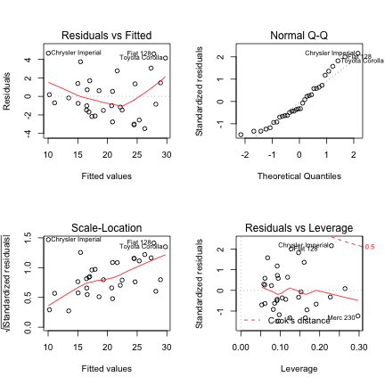

## Introduction
In this report, we will look at a data set of a collection of cars and explore answers to questions such as “Is an automatic or manual transmission better for MPG" and quantify the MPG difference between automatic and manual transmissions.

With the linear regression analysis, we found there is a significant difference bwteen the MPG for the automatic transmission cars and the manual transmission cars. Cars with manual transmission tend to have higher value of MPG where the mean is increased about 7 MPG.


## Exploratory data analysis
First we look at partial of the data set *mtcars* and its internal structure.

```r
library(ggplot2)
head(mtcars,3)
```

```
##                mpg cyl disp  hp drat    wt  qsec vs am gear carb
## Mazda RX4     21.0   6  160 110 3.90 2.620 16.46  0  1    4    4
## Mazda RX4 Wag 21.0   6  160 110 3.90 2.875 17.02  0  1    4    4
## Datsun 710    22.8   4  108  93 3.85 2.320 18.61  1  1    4    1
```

```r
str(mtcars,list.len=3)
```

```
## 'data.frame':	32 obs. of  11 variables:
##  $ mpg : num  21 21 22.8 21.4 18.7 18.1 14.3 24.4 22.8 19.2 ...
##  $ cyl : num  6 6 4 6 8 6 8 4 4 6 ...
##  $ disp: num  160 160 108 258 360 ...
##   [list output truncated]
```
There are eleven variables and from the document their meanings are as follows:
mpg,	Miles/(US) gallon;
cyl,	Number of cylinders;
disp,	Displacement (cu.in.);
hp,	Gross horsepower;
drat,	Rear axle ratio;
wt,	Weight (lb/1000);
qsec,	1/4 mile time;
vs,	V/S;
am,	Transmission (0 = automatic, 1 = manual);
gear,	Number of forward gears;
carb,	Number of carburetors. Next we convert some of the variables to factors.
```
mtcars$cyl <- factor(mtcars$cyl)
mtcars$vs <- factor(mtcars$vs)
mtcars$gear <- factor(mtcars$gear)
mtcars$carb <- factor(mtcars$carb)
mtcars$am <- factor(mtcars$am,labels=c('Auto','Manual'))
```
We are interested in the MPG difference between cars with automatic transmission and manual transmission, so we first use a box plot to plot MPG versus transmission to get a rough idea of how cars in the two groups behave(Appendix, Figure 1). 
We see the manual transmission cars seem to have higher MPG value in general. But there are other 9 variables in this dataset and they might also play a role in determing MPG. We use paired graph to explore relations between those factors(Appendix, Figure 2).
From the graph, we see the MPG has some correlation with other predictors such as cyl, disp, hp, drat and wt.

## Inference
We already know the MPG has some relation with the transmission type from the box plot. Next we will verify it with t test. We make the null hypothesis that there is no difference between the MPG of the automatic and manual transmissions and then apply R build-in t test function.

```r
ttest<-t.test(mpg~am,data=mtcars)
ttest
```

```
## 
## 	Welch Two Sample t-test
## 
## data:  mpg by am
## t = -3.7671, df = 18.332, p-value = 0.001374
## alternative hypothesis: true difference in means is not equal to 0
## 95 percent confidence interval:
##  -11.280194  -3.209684
## sample estimates:
## mean in group 0 mean in group 1 
##        17.14737        24.39231
```
We see the p-value is less than 0.05 so we reject the null hypothesis. Different transmission type do cause difference in MPG. But would some other preditors also contribute to the MPG level? We will analyze it in the following section.

## Model analysis
We first start with a model with only the transmission type as a predictor.

```r
am_model <- lm(mpg~am,data=mtcars)
summary(am_model)$sigma
```

```
## [1] 4.902029
```

```r
summary(am_model)$adj.r.squared
```

```
## [1] 0.3384589
```
This model has residual standard error 4.902 and adjusted R-squared value 0.3385, which means this model explains 34% of the variance of MPG. Obviously the low R-squared value suggests this is a very poor model and we might want to include other predictors as well. As mentioned above from the pair plot we observe variables cyl, disp, hp, drat, wt and am might have some relation with the mpg value. So we choose those predictors and build a regression model.

```r
observed_model<- lm(mpg~cyl+disp+hp+drat+wt+am,data=mtcars)
summary(observed_model)$sigma
```

```
## [1] 2.548989
```

```r
summary(observed_model)$adj.r.squared
```

```
## [1] 0.8211286
```
This model has residual standard error 2.549 and adjusted R-squared value 0.8211, which means this model explains 82% of the variance of MPG. It is not a perfect model but the results are improving. Next we fit the data to a model which includes all other variables as predictors to MPG.

```r
all_model<- lm(mpg~.,data=mtcars)
summary(all_model)$sigma
```

```
## [1] 2.650197
```

```r
summary(all_model)$adj.r.squared
```

```
## [1] 0.8066423
```
This model has residual standard error 2.65 and adjusted R-squared value 0.8066, which means it explains 80% of the variance of MPG. We use this model as a starting point and perform stepwise model selection to select signigicant factors for predicting MPG. The R function *step* will perform this selection by AIC.


```r
newmodel<-step(all_model)
```
Here is the summary of the model.

```r
summary(newmodel)
```

```
## 
## Call:
## lm(formula = mpg ~ wt + qsec + am, data = mtcars)
## 
## Residuals:
##     Min      1Q  Median      3Q     Max 
## -3.4811 -1.5555 -0.7257  1.4110  4.6610 
## 
## Coefficients:
##             Estimate Std. Error t value Pr(>|t|)    
## (Intercept)   9.6178     6.9596   1.382 0.177915    
## wt           -3.9165     0.7112  -5.507 6.95e-06 ***
## qsec          1.2259     0.2887   4.247 0.000216 ***
## am            2.9358     1.4109   2.081 0.046716 *  
## ---
## Signif. codes:  0 '***' 0.001 '**' 0.01 '*' 0.05 '.' 0.1 ' ' 1
## 
## Residual standard error: 2.459 on 28 degrees of freedom
## Multiple R-squared:  0.8497,	Adjusted R-squared:  0.8336 
## F-statistic: 52.75 on 3 and 28 DF,  p-value: 1.21e-11
```
So the model chosen by the *step* function includes predictor wt, qsec and am. This model has residual standard error 2.459 and adjusted R-squared value 0.83, which means this model explains 83% of the variance of MPG. This is the best we have so far.

## Residual analysis
Now we have the model with best performance and we want to diagnose the model. So we plot the fitted model shown in Figure 3(Appendix). The residual plot shows no obvious pattern which indicates no missing variables. The normal Q-Q plot shows the residuals are approximately of normal distribution. And the residual versus leverage plot says there is no outliers.


## Appendix

Figure 1.

```r
boxplot(mpg ~ am, data=mtcars, xlab="Transmission Type", ylab="MPG", main="")
```

 

Figure 2.

```r
pairs(mtcars,panel=panel.smooth,main="Mtcars data")
```

 

Figure 3.

```r
par(mfrow=c(2,2))
plot(newmodel)
```

 


